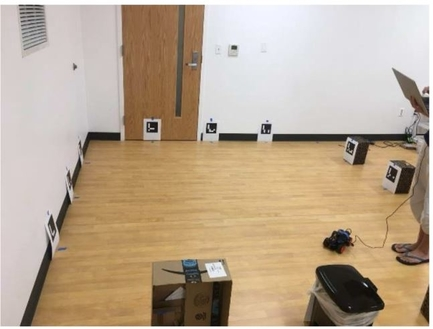
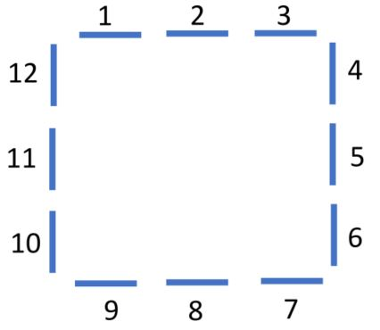
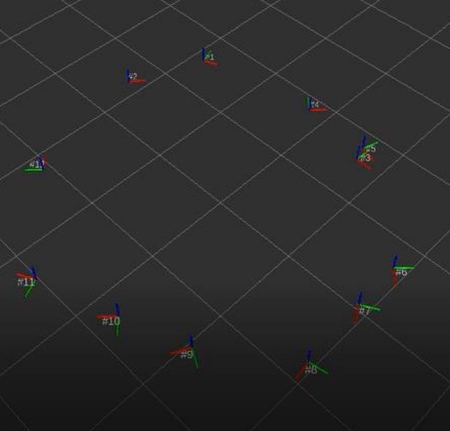
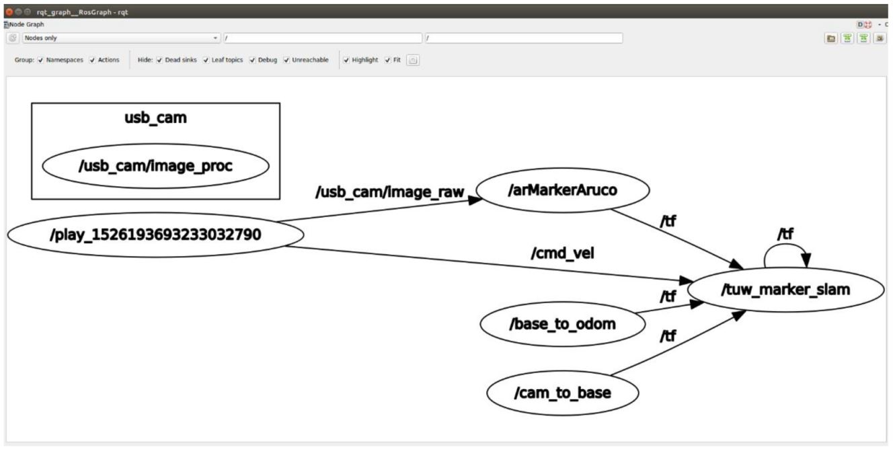

# **ROS SLAM** #
- - -
## **Introduction** ##
* ### Implemented ROS launch file to build a map using ROS packages

## **Environment** ##
* ### Real world

* ### Map


## **Results** ##
* ### Image
  
* ### rqt_graph
  
* ### [Video](https://youtu.be/bA_MkM1NLRY)

## **Requirements** ##
* ### Ubuntu 16.04
* ### ROS Kinetic

## **Installment** ##
* ### Put repository *SLAM_ROS/src* under ROS Workspace, i.e. ```~/catkin_ws```
* ### Put repository *SLAM_ROS/share* under ROS package path, i.e. ```/opt/ros/kinetic```

## **Run** ##
* ### Launch ROS launch file with ```roslaunch HW3.launch``` under ```/opt/ros/kinetic/share/usb_cam/launch```

## **ROS packages** ##
* ### [usb camera](http://wiki.ros.org/usb_cam)
* ### [joystick](http://wiki.ros.org/joy)
* ### [aruco](http://wiki.ros.org/tuw_aruco)
* ### [SLAM](http://wiki.ros.org/tuw_marker_slam)